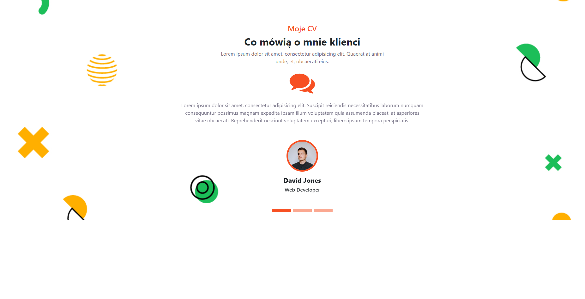

# Project Name

MojeCV

## Table of Contents

- [General Info](#general-information)
- [Technologies Used](#technologies-used)
- [Features](#features)
- [Screenshots](#screenshots)
- [Setup](#setup)
- [Usage](#usage)
- [Project Status](#project-status)
- [Room for Improvement](#room-for-improvement)
- [Acknowledgements](#acknowledgements)
- [Contact](#contact)
<!-- * [License](#license) -->

## General Information

Mała strona internetowa przedstawiająca animowane wypowiedzi o moich poprzednich pracaj

## Technologies Used

- Tech 1 - html
- Tech 2 - css
- Tech 3 - bootstrap5

## Features

List the ready features here:

- animacja przejscia

## Screenshots

<!-- If you have screenshots you'd like to share, include them here. -->

## Setup

nie potrzeba nic instalowac projekt sam dziala po otwarciu indexu w przegladarce

## Usage

Aplikacja stworzona w czystym html do upiekszenia zastosowano css i bootstrap

## Project Status

Project is: done. Mały projekt którego nie rozwazam kontynuować

## Room for Improvement

projekt zamkniety

## Acknowledgements

https://getbootstrap.com/

## Contact

Created by Mikolaj Barczynski

<!-- Optional -->
<!-- ## License -->
<!-- This project is open source and available under the [... License](). -->

<!-- You don't have to include all sections - just the one's relevant to your project -->
